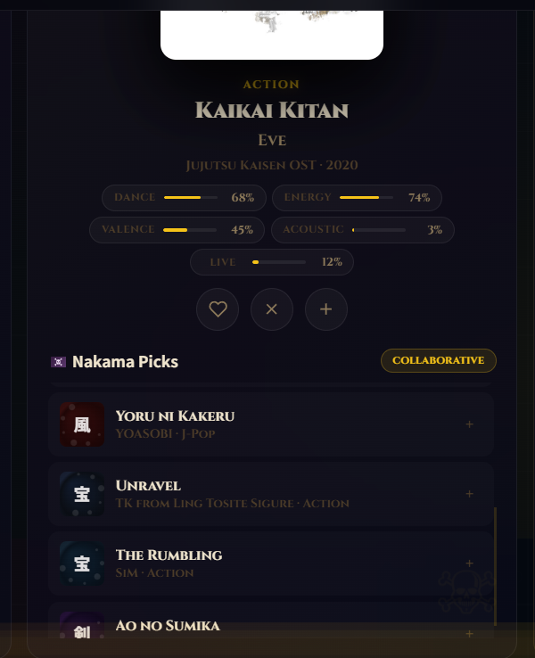
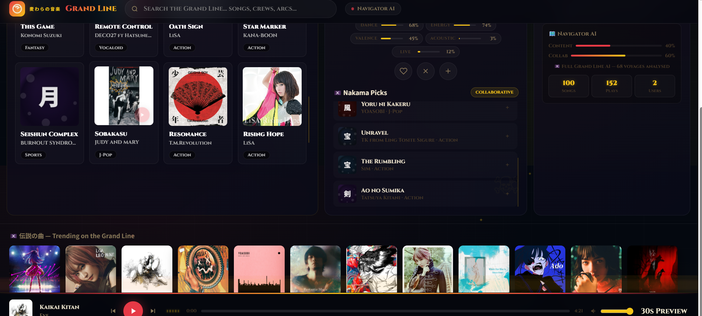

# ⚓ Grand Line Music — AI Music Recommendation System

## 📸 Screenshots

| 🌊 Full Grand Line Interface | 🗺️ Navigator AI & Nakama Picks |
| :---: | :---: |
|  |  |

Grand Line Music is a professional-grade, **One Piece-themed** full-stack web application that serves as a personalized AI music recommendation engine. Designed with a stunning deep ocean and gold pirate aesthetic, it learns your musical tastes as you listen and generates dynamic, infinite playlists.

## ✨ Features

- 🏴‍☠️ **Grand Line Aesthetic:** Immersive UI featuring custom ocean wave animations, golden treasure particle effects, Jolly Roger watermarks, and epic typography (Cinzel).
- 🧠 **Hybrid AI Engine (The Navigator AI):** 
  - Starts by using **Content-Based Filtering (K-Nearest Neighbors)** analyzing 14+ acoustic features (danceability, energy, tempo, valence, etc.).
  - Automatically transitions to **Collaborative Filtering (Singular Value Decomposition)** after logging 10 user interactions to provide deep, personalized recommendations.
- 🎵 **Full YouTube Playback:** Integrates the YouTube IFrame API to play full-length songs continuously in the background.
- 🌊 **Dynamic Mood Filters:** Filter by Hype, Emotional, Chill, Battle, Dance, or exclusively browse the **One Piece OST** collection.
- 🚀 **Infinite Scroll & Virtualization:** Flawless frontend performance loading hundreds of songs without UI lag.
- ⌨️ **Command Palette:** Press `Ctrl+K` to open a fuzzy-search spotlight menu (powered by Fuse.js) to find any song instantly.

## 🛠️ Technology Stack & Architecture

### Backend & Infrastructure
- **FastAPI**: The core high-performance web framework used to serve both the REST API endpoints and the frontend static assets. Chosen for its asynchronous capabilities and speed.
- **Python (Uvicorn)**: The ASGI server used to run the FastAPI application, ensuring concurrent request handling.
- **SQLite**: A lightweight relational database used to store song metadata, cache API responses (like iTunes preview URLs and YouTube IDs), and securely log session-based user interactions.

### Machine Learning & Data Science
- **Scikit-Learn**: 
  - **K-Nearest Neighbors (KNN)** is utilized for Content-Based Filtering, computing the cosine similarity between tracks based on 14+ audio features (e.g., valence, tempo, acousticness).
  - **Singular Value Decomposition (SVD)** is used to implement Collaborative Filtering, discovering latent features in user-item interaction matrices to provide highly personalized recommendations.
- **Pandas & NumPy**: Used heavily for data manipulation, normalization, and matrix operations within the recommendation engine.
- **Joblib**: Facilitates the saving and loading of pre-computed ML models and scalers for faster inference.

### Frontend Interface
- **Vanilla JavaScript**: All interactive logic, state management (doubly linked list for the queue), and infinite scrolling are written in pure JS to keep the application lightweight without heavy framework overhead.
- **HTML5 & Vanilla CSS3**: Implements the complex Grand Line styling (glassmorphism, CSS keyframe animations for the ocean waves and particles, responsive flexbox layouts) entirely from scratch.
- **Fuse.js**: A lightweight fuzzy-search library driving the `Ctrl+K` command palette to handle typos and partial matches instantly.

### External Services & APIs
- **YouTube IFrame Player API**: Intercepts the UI to seamlessly play full-length audio tracks in the background, matching dynamically fetched YouTube IDs with the current song.
- **iTunes Search API**: Used as a fast, reliable source to fetch high-resolution album artwork and 30-second audio previews when full tracks are loading or unavailable.

## 🚀 Running Locally

1. **Clone the repository and enter the directory.**
2. **Install dependencies:**
   ```bash
   pip install -r requirements.txt
   ```
3. **Start the FastAPI server:**
   ```bash
   uvicorn backend.main:app --reload
   ```
4. **Open your browser:**
   Navigate to `http://127.0.0.1:8000`.

## ☁️ Deployment

The project is fully prepared for zero-downtime deployment on platforms like **Render**:
1. Push this code to a GitHub repository.
2. Connect the repository to Render as a "Web Service".
3. Render will use the included `render.yaml` to automatically install requirements and start the FastAPI server.

---
*"Wealth, fame, power... The man who had acquired everything in this world, the Pirate King, Gold Roger."*
